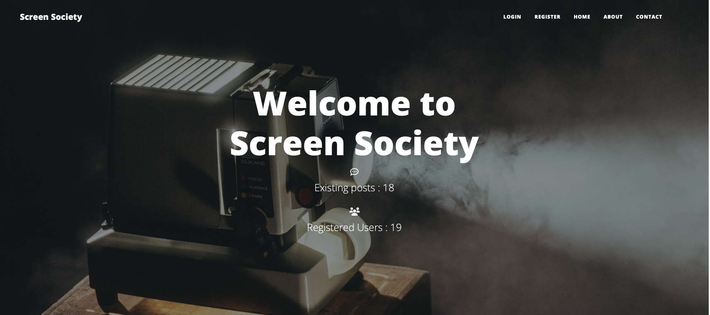
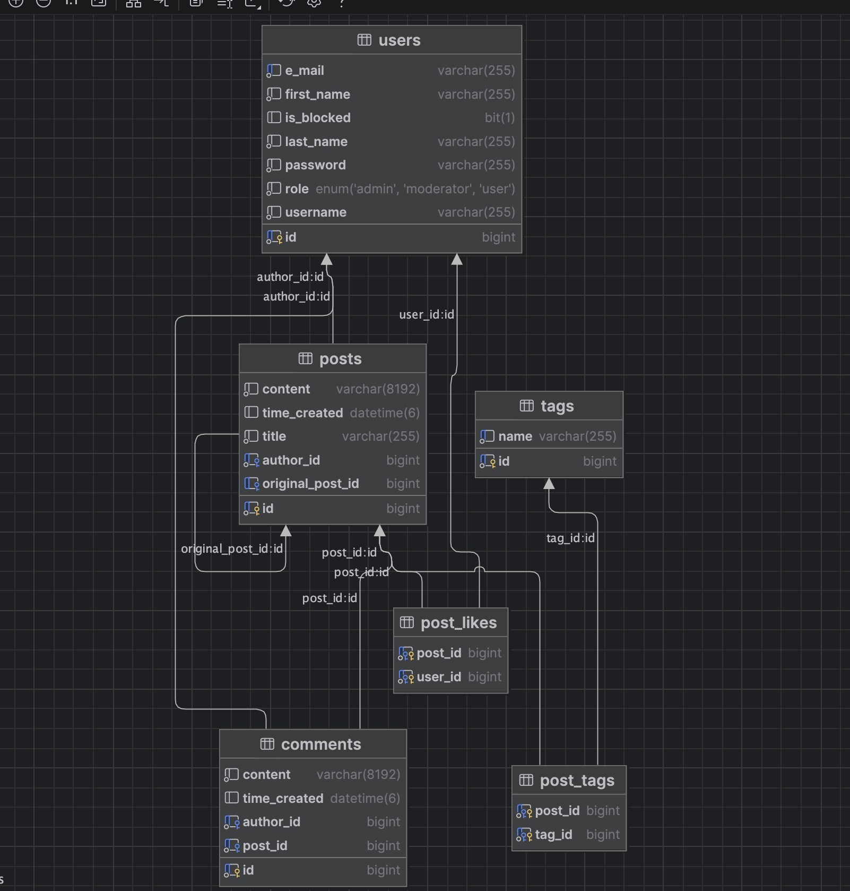

# Screen Society

A community forum for movies, TV shows, and entertainment news — built as a team capstone project during [Telerik Academy](https://www.telerikacademy.com/)'s Java Alpha Track.




## Overview

Users can create posts about movies and TV shows, comment and reply, like and
repost content, and organize discussions with tags. Includes moderation
tooling (user blocking, admin roles) and a tag-based discovery system.

## Features

- Post creation, editing, and deletion
- Commenting on posts
- Liking and reposting
- Tagging posts (author or admin)
- Full-text/filterable post search
- Role-based access control (user / admin, blocked users)
- REST API documented with Swagger/OpenAPI

## Tech Stack

- **Backend:** Java 17, Spring Boot 4.1, Spring Security, Spring Data JPA (Hibernate)
- **Frontend:** Thymeleaf, HTML/CSS
- **Database:** MySQL
- **API Docs:** springdoc-openapi (Swagger UI)
- **Testing:** JUnit 5, Mockito
- **Build:** Gradle
- **Other:** Lombok

## Quick Start (Docker)

The fastest way to run the app locally — spins up the application together
with a disposable local MySQL database.

```bash
git clone https://github.com/AlphaJavaTrackWebProject/screen-society.git
cd screen-society
cp .env.example .env
docker compose up --build
```

The app will be available at **http://localhost:8080**, and the API docs at
**http://localhost:8080/swagger-ui/index.html**.

### Demo accounts

Seeded automatically on first startup (Docker only, via the `demo` profile):

| Role      | Username   | Password       |
|-----------|------------|----------------|
| Admin     | `admin`     | `Password123!` |
| Moderator | `moderator` | `Password123!` |
| User      | `demo`      | `Password123!` |
| User      | `jane`      | `Password123!` |

The database also comes pre-populated with a few posts, comments, likes,
tags, and a repost so the feed isn't empty on first load.

## Running Without Docker

<details>
<summary>Manual setup (requires your own MySQL instance)</summary>

1. Create a MySQL database.
2. Set the following environment variables (or a `.env`/IDE run config):
    - `DB_URL` — e.g. `jdbc:mysql://localhost:3306/screensociety`
    - `DB_USERNAME`
    - `DB_PASSWORD`
3. Run:
   ```bash
   ./gradlew bootRun
   ```

</details>

## Environment Variables

| Variable            | Description                              | Default (Docker) |
|---------------------|-------------------------------------------|-------------------|
| `DB_NAME`           | Local MySQL database name                 | `screensociety`   |
| `DB_USER`           | Local MySQL user                          | `screensociety`   |
| `DB_PASSWORD`       | Local MySQL password                      | `screensociety`   |
| `DB_ROOT_PASSWORD`  | Local MySQL root password                 | `rootpassword`    |


## Project Structure

```
src/main/java/org/alphatrack/screensociety/
├── controllers/     REST + MVC controllers
├── services/        Business logic
├── repositories/    Data access layer
├── models/          JPA entities
├── dto/             Request/response DTOs
├── exceptions/      Custom exceptions + handlers
└── security/        Spring Security configuration
```

## Solution Architecture

Layered architecture: controllers handle HTTP concerns and delegate to
services, services own business logic and authorization checks, and
repositories handle persistence via Spring Data JPA.



## Testing

```bash
./gradlew test
```

## Roadmap

- [ ] Deploy a live demo
- [ ] Seed demo data for first-run experience
- [ ] Prune stale branches

## Contributors

| Name | GitHub |
|------|--------|
| Svetoslav Stoyanov | [@stoyanovse](https://github.com/stoyanovse) |
| Alexander Ivanov | [@Aleksandar-hash](https://github.com/Aleksandar-hash) |

## License

This project is licensed under the MIT License.
